# Open Historia

**Rewrite history through AI-powered grand strategy.**

Open Historia is a unique strategy game where you command nations using natural language. Issue orders like "Invade West Coast" or "Negotiate trade with Japan", and watch as AI adjudicates outcomes, drives independent nation behavior, and creates emergent narratives spanning from ancient empires to speculative futures.

---

## Deployment & External Services

| Concern | Service |
|---------|---------|
| Hosting | Cloudflare Workers (`open-historia`) — Hono worker (`src/worker.ts`) serving a Vite/React SPA + Astro landing via the `ASSETS` binding |
| Database | Cloudflare D1 via Drizzle ORM |
| Auth | better-auth + Google OAuth (optional) |
| AI | free-ai-gateway chokepoint; Anthropic, OpenAI, Google Gemini & DeepSeek APIs supported (server-side in `src/worker/routes/llm.ts`) |
| CI/CD | GitHub Actions — CI on pushes/PRs; manual SHA-tagged production deployment from `main` |

Rate limiting on AI routes is an in-memory sliding-window limiter (`lib/rate-limit.ts`).

---

## Problem

Traditional grand strategy games require complex menu navigation, steep learning curves, and rigid rule systems. Players spend more time managing UIs than making strategic decisions. Open Historia removes these barriers by letting you command nations the way a real leader would - through natural language - while AI handles the complexity of simulation and world response.

---

## Features

### AI Game Master
- **Multiple Providers**: Choose Claude, GPT-4, Gemini, DeepSeek, or local dev mode
- **5 Difficulty Levels**: From Sandbox (anything goes) to Impossible (ruthless realism)
- **Dynamic Narrative**: AI generates unique events, consequences, and independent nation behavior
- **Era-Aware**: AI adjusts for ancient empires, medieval kingdoms, or modern nation-states

### Interactive World Map
- **3-Tier LOD**: Seamless zoom from countries to regions to individual states (MapLibre GL JS)
- **Real Geography**: High-resolution world map with accurate borders using Natural Earth data
- **Sub-National Provinces**: Capture regions piecemeal (e.g., "California (USA)")
- **Click to Select**: Click any province to highlight and interact with the whole country
- **Multiple Themes**: Classic, cyberpunk, parchment, blueprint aesthetics
- **Relation Borders**: War zones pulse red, hostile borders flash orange, allied borders glow green

### Diplomacy Engine
- **Direct Chat**: Negotiate with AI leaders one-on-one
- **Era-Appropriate**: Medieval kings speak differently than modern presidents
- **Strategic AI**: Nations pursue self-interest, form alliances, react to threats
- **Relationship Tracking**: Neutral, friendly, allied, hostile, war, vassal states

### Rich Systems
- **Order Queue**: Queue multiple commands, then advance time to execute
- **Timeline Rewind**: Review past turns, branch alternate timelines
- **AI Advisor**: Ask strategic questions, get tailored military/diplomatic/economic advice
- **Cloud Saves**: Cross-device sync with Google sign-in (optional)
- **20+ Presets**: Jump into curated scenarios from history, alternate timelines, or fiction

---

## Architecture

```mermaid
graph TB
    subgraph "Frontend (Vite + React 19 SPA)"
        UI["UI Components"]
        Map["Interactive Map - MapLibre GL JS"]
        Game["Game State Manager"]
        UI --> Map
        UI --> Game
    end

    subgraph "API Layer (Hono Cloudflare Worker)"
        Turn["POST /api/turn - Execute Commands"]
        Chat["POST /api/chat - Diplomacy"]
        Advisor["POST /api/advisor - Strategic Advice"]
        Auth["/api/auth/* - Better Auth"]
        Saves["/api/saves - CRUD + upload"]
    end

    subgraph "AI Providers"
        Claude["Claude API (Anthropic)"]
        GPT["GPT-4 API (OpenAI)"]
        Gemini["Gemini API (Google)"]
        DeepSeek["DeepSeek API"]
        Local["Local AI (Dev)"]
    end

    subgraph "Data Storage"
        D1[("Cloudflare D1")]
        LocalStorage["Browser LocalStorage - Offline Saves"]
    end

    subgraph "External Data"
        NaturalEarth["Natural Earth - Map Data"]
        WorldAtlas["World Atlas - TopoJSON"]
    end

    UI --> Turn
    UI --> Chat
    UI --> Advisor
    UI --> Auth
    UI --> Saves
    Map --> NaturalEarth
    Map --> WorldAtlas

    Turn --> Claude
    Turn --> GPT
    Turn --> Gemini
    Turn --> DeepSeek
    Turn --> Local
    Chat --> Claude
    Chat --> GPT
    Chat --> Gemini
    Chat --> DeepSeek
    Advisor --> Claude
    Advisor --> GPT
    Advisor --> Gemini

    Saves --> D1
    Saves --> LocalStorage
    Auth --> D1

    style UI fill:#4a90e2
    style Map fill:#4a90e2
    style Game fill:#4a90e2
    style Turn fill:#50c878
    style Chat fill:#50c878
    style Advisor fill:#50c878
    style Auth fill:#50c878
    style Saves fill:#50c878
    style Claude fill:#f4a261
    style GPT fill:#f4a261
    style Gemini fill:#f4a261
    style DeepSeek fill:#f4a261
    style Local fill:#f4a261
    style D1 fill:#e76f51
    style LocalStorage fill:#e76f51
```



### Tech Stack

- **Vite 8 + React 19 SPA** (react-router) + TypeScript; React Compiler on
- **Hono on Cloudflare Workers** for the API + asset serving (`src/worker.ts`)
- **MapLibre GL JS** for WebGL map rendering with hierarchical LOD (Natural Earth 50m data)
- **Tailwind CSS 4** for dark-themed UI
- **Cloudflare D1 + Drizzle** for cloud saves (optional)
- **Better Auth** with Google OAuth (optional)
- **Multi-AI Support**: Claude, GPT-4, Gemini, DeepSeek, free-ai-gateway, or local development mode

### Key Components

- **Frontend**: React SPA components with MapLibre GL JS (WebGL) map visualization
- **Worker API**: Hono routes (`src/worker/routes/*.ts`) handle AI provider calls and data persistence server-side
- **Game Engine**: Client-side game state management with turn-based execution
- **AI Integration**: Unified server-side interface to multiple AI providers with prompt engineering
- **Storage Layer**: Dual-mode saves (cloud via D1 or local browser storage)

---

## Getting Started

### Installation

```bash
git clone https://github.com/sarthak-fleet/open-historia.git
cd open-historia
pnpm install
```

### Running the Game

```bash
pnpm dev
```

`pnpm dev` runs `wrangler dev` (the worker, on http://localhost:8787) and `vite`
(the frontend dev server, on http://localhost:5173) concurrently. Open
[http://localhost:8787](http://localhost:8787) to use the worker-served app.

### How to Play

1. **Choose a scenario** (WWII, Cold War, custom, etc.)
2. **Pick your nation** (any country on the map)
3. **Configure AI** (provider + difficulty)
4. **Start commanding** your nation through natural language

### Optional: Cloud Saves Setup

For cross-device saves and authentication, run the Worker locally so Wrangler
provides the local `DB` binding, then configure the non-database auth values:

```env
# Better Auth
BETTER_AUTH_SECRET=random-32-char-secret
BETTER_AUTH_URL=http://localhost:8787

# Google OAuth (cloud saves)
GOOGLE_CLIENT_ID=your-client-id.apps.googleusercontent.com
GOOGLE_CLIENT_SECRET=your-secret
```

Then run database migrations:

```bash
pnpm db:generate       # Generate migrations
pnpm db:migrate:local  # Apply to isolated local D1
```

Production schema changes use `pnpm db:migrate:remote` after review. The game
works fully offline with local saves if you skip cloud-save authentication.

---

## Example Gameplay

**Scenario**: World War II (1939)
**Nation**: United Kingdom
**Difficulty**: Realistic

```
> Evacuate children from London to countryside

AI: Operation Pied Piper initiated. 3.5 million evacuated to safety.

> Send diplomatic mission to USA requesting aid

AI (USA): President Roosevelt is sympathetic, but Congress remains isolationist.
          We can offer Lend-Lease equipment, but no troops yet.

> Prepare Royal Navy for North Atlantic convoy defense

AI: Fleet mobilized. U-boat threat assessed as severe. Convoys organized.

[Advance 1 month]

AI: Germany launches air raids on British shipping.
    Royal Navy sinks 3 U-boats. France requests reinforcements.
```

---

## Scenarios

### Historical
WWII (1939), Cold War (1962), Fall of Rome (476 AD), Viking Age (793 AD), Age of Exploration (1492), Napoleon (1799), Mongol Invasions (1206), WWI (1914), Renaissance (1453), Three Kingdoms China (220 AD)

### Modern
2026 Geopolitical Tensions, 2027 Fracturing NATO Alliance

### Alternate History
USSR Survives (1995), Byzantine Revival (1204), Climate Collapse (2040)

### Fictional
Zombie Apocalypse (2026), AI Awakening (2030), Mars Colonization (2035)

### Story Room Prototype (v0.1) — ARCHIVED 2026-07-02
The local collaborative-canon prototype (`/story-room`) has been **archived and removed from
navigation**. It was a divergent, local-only experiment (no persistence, no API, no connection
to the core strategy loop) that split polish from the primary grand-strategy experience. The
code is retained in-repo (`components/StoryRoomPrototype.tsx`, `src/pages/StoryRoomPage.tsx`,
`lib/story-room-fixtures.ts`, `STORY-ROOMS.md`) as an archived experiment; the route is no
longer wired in `src/router.tsx`. See `PROJECT_STATUS.md` for the full decision rationale.

---

## Development

### Scripts

```bash
pnpm dev          # wrangler dev (worker) + vite (frontend), concurrently
pnpm build        # vite build → dist/
pnpm cf:build     # vite build + Astro landing overlay (used by deploy)
pnpm deploy       # validate env + cf:build + wrangler deploy
pnpm lint         # ESLint
pnpm typecheck    # tsc (app + worker tsconfigs)
pnpm test         # Vitest unit tests
pnpm test:e2e     # Playwright e2e
```

### For AI Agents

See **AGENTS.md** for comprehensive development documentation including:
- Complete file map with all components and their purposes
- Architecture patterns and technical decisions
- AI prompt system details
- Common tasks with code examples
- Coding conventions and pitfalls
- Testing strategies

---

## FAQ

**Q: Do I need an API key?**
A: Yes, from Anthropic, OpenAI, Google, or DeepSeek. Or use Local AI for development (no key needed).

**Q: Are saves stored online?**
A: Optional. Local-only saves work without authentication. Cloud saves require Google sign-in.

**Q: Can I play offline?**
A: No, AI providers require internet. Local AI also needs network.

**Q: How much do API calls cost?**
A: Varies by provider. Typical: $0.10-$0.50/hour on GPT-4, less on Gemini/DeepSeek.

**Q: Can I create custom scenarios?**
A: Yes. Click "Custom Scenario" and write your own setup.

**Q: Is multiplayer supported?**
A: Not yet. Single-player only (you vs. AI nations).

**Q: Can I mod the game?**
A: Yes, it's open source. Fork and modify. See AGENTS.md for developer docs.

---

## License

MIT License - see LICENSE file for details

---

## Links

- **Repository**: [github.com/sarthak-fleet/open-historia](https://github.com/sarthak-fleet/open-historia)
- **AI Developer Docs**: See AGENTS.md
- **Issues**: [GitHub Issues](https://github.com/sarthak-fleet/open-historia/issues)

---

**Rewrite history. Command nations. Shape the world.**

<!-- ACTIVE-AI-TASK-LOG:START -->
## Active AI Task Log

This section is maintained by the SaaS Maker Active-AI product/design loop so future agents do not reopen duplicate UI tasks.

- Business lane: P2 Watch / maintenance
- Rule: do not create another broad "improve the UI" task unless the acceptance criteria differ materially from the tasks listed here.
- Source of truth for task status: SaaS Maker task board. README entries are durable context only.

- No current Active-AI product/design task from the 2026-05-25/26 loop. Treat this as watch/status unless new evidence appears.
- 2026-05-26 — Landing page now shows a concrete WWII sample timeline (sourced from `lib/presets.ts` `ww2-1939`) plus a "Start exploring" CTA in `components/PresetBrowser.tsx`. Cheap activation proof; no new task should re-add this.
<!-- ACTIVE-AI-TASK-LOG:END -->

## Campaign qualification

This remains a held experiment. The [September 9 guest rewind receipt](docs/qualification/rewind-2026-09-09/README.md) verifies local save/reload and complete prompt-memory rewind for newly recorded snapshots. Older snapshots are inspection-only when historical memory is absent. The [panel and branch layout receipt](docs/qualification/layout-2026-09-09/README.md) covers desktop panel separation and mobile timeline access. Historical faction/map quality and authenticated saves remain in [issue 27](https://github.com/sarthakagrawal927/open-historia/issues/27).
